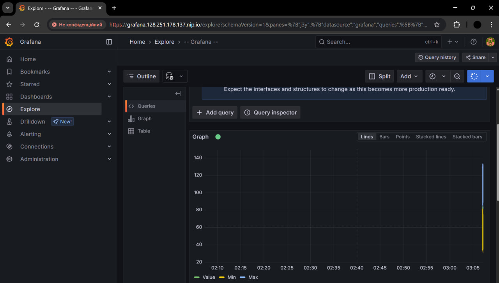
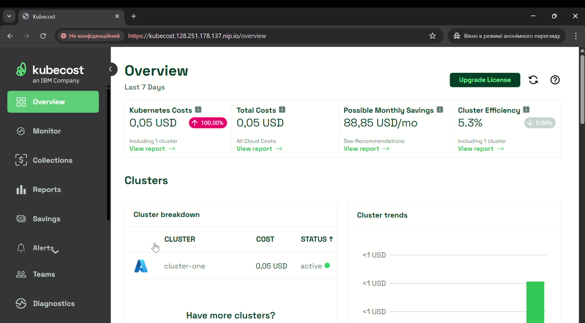
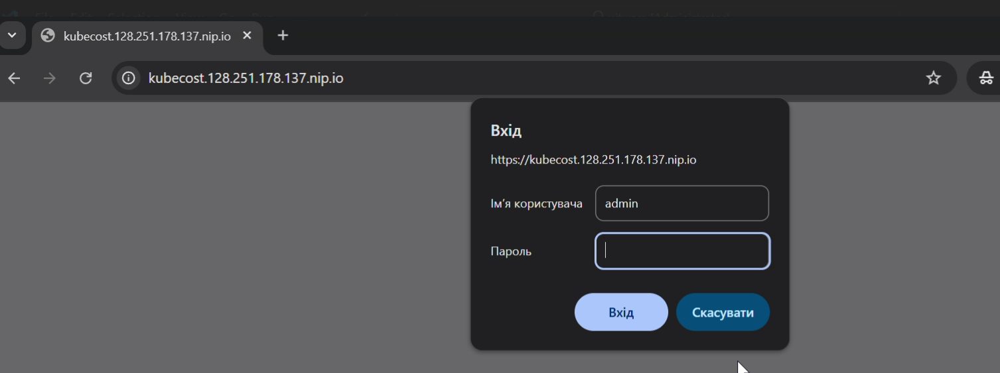
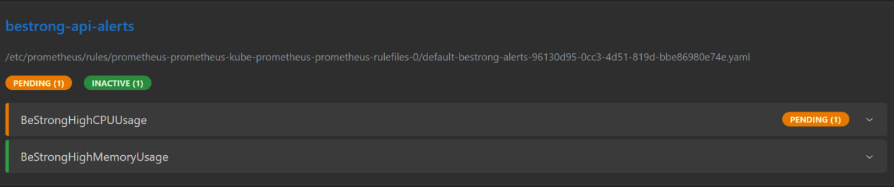
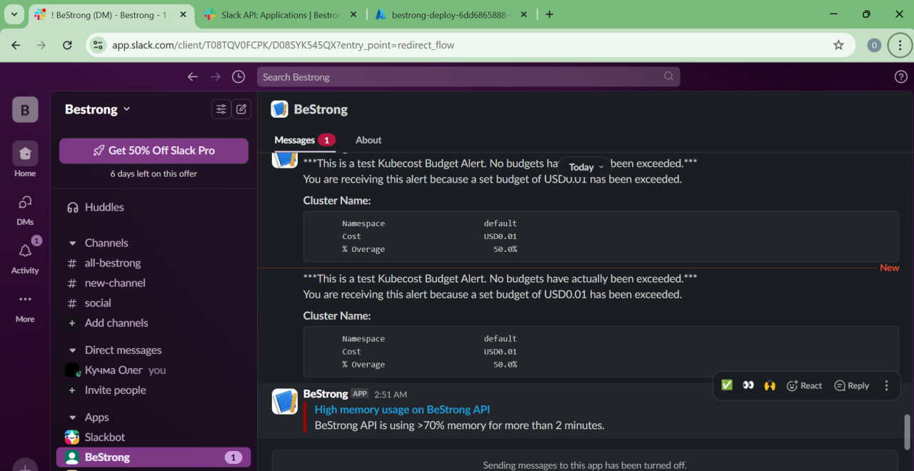

# TASK 14.05

1. Setup Prometheus and Grafana in your AKS cluster.
2. Setup Prometheus Alert when "BeStrong" API memory and CPU usage is > 70%
3. Make Grafana accessible from the Internet
4. Enable HTTPS (you may use fake SSL certs from cert-manager, the same way as in the previous task)
5. Requirements for the teams: additonally, to enable some FinOps insights:
   Setup KubeCost to monitor your AKS cluster Make KubeCost accessible from the Internet Configure KubeCost alert (threshold - more than $20 daily)
   Setup Ingress for KubeCost dashboard with basic authentication to protect your KubeCost Enable HTTPS (you may use fake SSL certs from cert-manager, the same way as in previous task)

## Add repositories with helm charts

```bash
helm repo add kubecost https://kubecost.github.io/cost-analyzer

helm repo add grafana https://grafana.github.io/helm-charts

helm repo add prometheus-community https://prometheus-community.github.io/helm-charts
```

## Install nginx-ingress controller

```bash
kubectl apply -f https://raw.githubusercontent.com/kubernetes/ingress-nginx/controller-v1.9.4/deploy/static/provider/cloud/deploy.yaml
```

## Get the external-ip

```bash
kubectl get svc ingress-nginx-controller -n ingress-nginx
```

## Apply cert-manager

```bash
kubectl apply -f https://github.com/cert-manager/cert-manager/releases/latest/download/cert-manager.yaml
```

## Apply ClusterIssuer

```bash
kubectl apply -f cluster-issuer.yaml
```

## Install Prometheus, Grafana and Kubecost via helm

```bash
helm install grafana grafana/grafana -f grafana-values.yaml

helm install prometheus prometheus-community/kube-prometheus-stack -f prometheus-ingress.yaml

helm install kubecost kubecost/cost-analyzer -n kubecost --create-namespace \
  --set kubecostToken="aGVsbUBrdWJlY29zdC5jb20=xm343yadf98"
```



## Apply kubecost-ingress.yaml to make it accesible

```bash
kubectl apply -f kubecost-ingress.yaml
```



## Create basic authentication for kubecost

```bash
kubectl apply -f kubecost-basic-auth.yaml
```



## Apply .yaml files for alerts in prometheus

```bash
kubectl apply -f alertmanager-config.yaml

kubectl apply -f bestrong-alerts.yaml
```





### Demo of created services:

https://drive.google.com/drive/folders/1u7n5O7GTWW3ywVx7reBaBY6sFRTZLlEm
